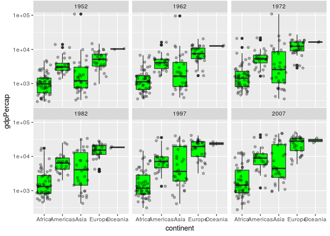

Homework 2:
================
Sarafa Iyaniwura
September 20, 2018

-   [Exploring Gapminder data using **dplyr** and **ggplot2**](#exploring-gapminder-data-using-dplyr-and-ggplot2)
    -   [1. Loading libraries](#loading-libraries)
    -   [2. Smell testing the data: exploring the features of the data](#smell-testing-the-data-exploring-the-features-of-the-data)
        -   [2.1 **str()** function](#str-function)
        -   [2.2 **class()** function](#class-function)
        -   [2.3 **dim(), nrow(), ncol(), and names()** functions](#dim-nrow-ncol-and-names-functions)
        -   [2.4 **sapply()** function](#sapply-function)
    -   [3. Exploring individual variable](#exploring-individual-variable)
    -   [3.1 Qualitative data](#qualitative-data)
        -   [3.1.1 **Bar chart**](#bar-chart)
        -   [3.1.2 **Pie chart**](#pie-chart)
        -   [3.1.3 **Bullseye chart**](#bullseye-chart)
        -   [3.1.3 **filter()**](#filter)
    -   [3.2 Quantitative data](#quantitative-data)
        -   [3.2.1 **select()** and **unique** functions](#select-and-unique-functions)
        -   [3.2.2 **summary()** function](#summary-function)
        -   [3.2.3 **histogram()** and **density()**](#histogram-and-density)
        -   [3.2.4 **facet\_wrap()**](#facet_wrap)
    -   [4. Exploring various plots](#exploring-various-plots)
        -   [4.1 Gdp per capital and population](#gdp-per-capital-and-population)
        -   [4.1 Population and life expectancy](#population-and-life-expectancy)
        -   [4.3 Gdp per capital and continent](#gdp-per-capital-and-continent)
    -   [4.1 Extracting part of the data and exploring it.](#extracting-part-of-the-data-and-exploring-it.)
    -   [I want to do more](#i-want-to-do-more)
        -   [**kableExtra**](#kableextra)

Exploring Gapminder data using **dplyr** and **ggplot2**
========================================================

In this assignment, we explore the gapminder data set using the data wranggling library **dplyr** and data exploration library **ggplot2**, used for plotting data. The **dplyr** library is loaded through the **tidyverse** library.

1. Loading libraries
--------------------

First, let us load the libraries that would be used to explore the data set. Here, we load the **gapminder** data set and the **tidyverse** library.

``` r
library(gapminder)  # loads gapminder data
library(tidyverse)  # loads the tidyverse library
```

    ## Warning: replacing previous import by 'tibble::as_tibble' when loading
    ## 'broom'

    ## Warning: replacing previous import by 'tibble::tibble' when loading 'broom'

    ## ── Attaching packages ────────────────────────────────── tidyverse 1.2.1 ──

    ## ✔ ggplot2 3.0.0     ✔ purrr   0.2.5
    ## ✔ tibble  1.4.2     ✔ dplyr   0.7.6
    ## ✔ tidyr   0.8.1     ✔ stringr 1.3.1
    ## ✔ readr   1.1.1     ✔ forcats 0.3.0

    ## ── Conflicts ───────────────────────────────────── tidyverse_conflicts() ──
    ## ✖ dplyr::filter() masks stats::filter()
    ## ✖ dplyr::lag()    masks stats::lag()

2. Smell testing the data: exploring the features of the data
-------------------------------------------------------------

In this section, we shall check the features of the data such as the structure, the number and data types of the variables, the dimension of the data, among others.

### 2.1 **str()** function

This function is used to check the structure and class of the data. It give a comprehensive information about the data. Let us see how this function is used and the output it produces.

``` r
str(gapminder)  # displays the structure of the data like the variables, their types, the dimension, ...
```

    ## Classes 'tbl_df', 'tbl' and 'data.frame':    1704 obs. of  6 variables:
    ##  $ country  : Factor w/ 142 levels "Afghanistan",..: 1 1 1 1 1 1 1 1 1 1 ...
    ##  $ continent: Factor w/ 5 levels "Africa","Americas",..: 3 3 3 3 3 3 3 3 3 3 ...
    ##  $ year     : int  1952 1957 1962 1967 1972 1977 1982 1987 1992 1997 ...
    ##  $ lifeExp  : num  28.8 30.3 32 34 36.1 ...
    ##  $ pop      : int  8425333 9240934 10267083 11537966 13079460 14880372 12881816 13867957 16317921 22227415 ...
    ##  $ gdpPercap: num  779 821 853 836 740 ...

Observe that this function has given us a lot of information about the data. Information such as the class of the data, the number of variables, the type of each of the variable and so on. It is important to mention that one can still check for this properties of the data using some other functions.

Before we use other functions to explore the structure of thiz data, let us view its first few rows using the **head()** function

``` r
head(gapminder) # displays the first few rows of the data (default is 6)
```

    ## # A tibble: 6 x 6
    ##   country     continent  year lifeExp      pop gdpPercap
    ##   <fct>       <fct>     <int>   <dbl>    <int>     <dbl>
    ## 1 Afghanistan Asia       1952    28.8  8425333      779.
    ## 2 Afghanistan Asia       1957    30.3  9240934      821.
    ## 3 Afghanistan Asia       1962    32.0 10267083      853.
    ## 4 Afghanistan Asia       1967    34.0 11537966      836.
    ## 5 Afghanistan Asia       1972    36.1 13079460      740.
    ## 6 Afghanistan Asia       1977    38.4 14880372      786.

This function gave us the first 6 rows of the data, we can always get more by using

``` r
head(gapminder,15) # displays the first 15 rows of the gapminder data
```

    ## # A tibble: 15 x 6
    ##    country     continent  year lifeExp      pop gdpPercap
    ##    <fct>       <fct>     <int>   <dbl>    <int>     <dbl>
    ##  1 Afghanistan Asia       1952    28.8  8425333      779.
    ##  2 Afghanistan Asia       1957    30.3  9240934      821.
    ##  3 Afghanistan Asia       1962    32.0 10267083      853.
    ##  4 Afghanistan Asia       1967    34.0 11537966      836.
    ##  5 Afghanistan Asia       1972    36.1 13079460      740.
    ##  6 Afghanistan Asia       1977    38.4 14880372      786.
    ##  7 Afghanistan Asia       1982    39.9 12881816      978.
    ##  8 Afghanistan Asia       1987    40.8 13867957      852.
    ##  9 Afghanistan Asia       1992    41.7 16317921      649.
    ## 10 Afghanistan Asia       1997    41.8 22227415      635.
    ## 11 Afghanistan Asia       2002    42.1 25268405      727.
    ## 12 Afghanistan Asia       2007    43.8 31889923      975.
    ## 13 Albania     Europe     1952    55.2  1282697     1601.
    ## 14 Albania     Europe     1957    59.3  1476505     1942.
    ## 15 Albania     Europe     1962    64.8  1728137     2313.

Also, the last few rows of a data frame can be displayed by using the **tail()** function:

``` r
tail(gapminder) # displays the last few rows of the data (default is 6)
```

    ## # A tibble: 6 x 6
    ##   country  continent  year lifeExp      pop gdpPercap
    ##   <fct>    <fct>     <int>   <dbl>    <int>     <dbl>
    ## 1 Zimbabwe Africa     1982    60.4  7636524      789.
    ## 2 Zimbabwe Africa     1987    62.4  9216418      706.
    ## 3 Zimbabwe Africa     1992    60.4 10704340      693.
    ## 4 Zimbabwe Africa     1997    46.8 11404948      792.
    ## 5 Zimbabwe Africa     2002    40.0 11926563      672.
    ## 6 Zimbabwe Africa     2007    43.5 12311143      470.

Similarly, **tail(gapminder,n)** can be used to display the last *n* rows of the gapminder data.

Now, let us check the features of the gapminder data one after the other.

### 2.2 **class()** function

``` r
class(gapminder)  # displays the class of the data
```

    ## [1] "tbl_df"     "tbl"        "data.frame"

1.  *tbl\_df*: tibbles data frame
2.  *tbl* : tibbles
3.  *data.frame*: data frame

This tells us that the gapminder data is a data frame.

### 2.3 **dim(), nrow(), ncol(), and names()** functions

The next few function are used to display the dimension, the number of rows and columns, and the variables in the data.

``` r
dim(gapminder) #  diplays  the dimension of data
```

    ## [1] 1704    6

``` r
nrow(gapminder) #  diplays  the number of rows
```

    ## [1] 1704

``` r
ncol(gapminder) #  diplays  the number of columns
```

    ## [1] 6

``` r
names(gapminder) # diplays the varibles/fields in the data 
```

    ## [1] "country"   "continent" "year"      "lifeExp"   "pop"       "gdpPercap"

### 2.4 **sapply()** function

This function applies a specific function to a group of variables. Let us illusttrate how it works by using it to get the class of each of the variables in the gapminder data.

We use **sapply()** function to check the class of the variables in our data as follows.

``` r
sapply(gapminder,class) # applies the 'class()' function to each variable in the gapminder data
```

    ##   country continent      year   lifeExp       pop gdpPercap 
    ##  "factor"  "factor" "integer" "numeric" "integer" "numeric"

| Variables     | data class         |
|---------------|--------------------|
| country       | factor/categorical |
| continent     | factor/categorical |
| year          | numeric            |
| lifeExp       | integer            |
| pop gdpPercap | numeric            |

As another example, let us use the **sapply()** function to gapply the function **typeof()** to the gapminder data.

``` r
sapply(gapminder,typeof) # applies the 'typeof()' function to each variable in the gapminder data
```

    ##   country continent      year   lifeExp       pop gdpPercap 
    ## "integer" "integer" "integer"  "double" "integer"  "double"

Note that what we got is not what we are actually expecting, for example, 'country' is categorical data but it gives integer. This is because the **typeof()** function returns the types of R objects.

Let us try these same explorations by piping into the functions.

``` r
gapminder %>%  # loads the gapminder data (and the result is piped into the next function)
  sapply(class) # applies the class function on the loaded data
```

    ##   country continent      year   lifeExp       pop gdpPercap 
    ##  "factor"  "factor" "integer" "numeric" "integer" "numeric"

``` r
gapminder %>% # loads the gapminder data (and the result is piped into the next function)
  sapply(typeof) # applies the typeof() function on the loaded data
```

    ##   country continent      year   lifeExp       pop gdpPercap 
    ## "integer" "integer" "integer"  "double" "integer"  "double"

3. Exploring individual variable
--------------------------------

3.1 Qualitative data
--------------------

Let us begin by considering the **continent** variable. We first explore this variable using bar chat.

### 3.1.1 **Bar chart**

``` r
barchart <- gapminder %>%  # loads the gapminder data
  ggplot(aes(x=continent,fill=continent)) + # calls the ggplot function and specify the axis and fill
    geom_bar()  # specify the type of  plot

barchart #sdisplays the bar chart
```


This bar chart shows the number of observations available for each continent. For instance, we have over 600 observation from Africa, around 400 for Asia, and around 300 for America.

This information can be shown more precisely by extracting the 'continent' column from the data and summarizing it as shown below;

The **table()** and **summary()** function

``` r
sumAry <- gapminder %>%  # loads gapminder data
  select(continent) %>% # extract the column for continents
    summary()   # present a summary of the result
sumAry
```

    ##     continent  
    ##  Africa  :624  
    ##  Americas:300  
    ##  Asia    :396  
    ##  Europe  :360  
    ##  Oceania : 24

We can also use the **table()** function to show the same result.

``` r
cont_table <- gapminder %>%  # loads gapminder data
  select(continent) %>% # extract the column for continents
    table()  # present the result in  a table

cont_table  # display the table
```

    ## .
    ##   Africa Americas     Asia   Europe  Oceania 
    ##      624      300      396      360       24

The **table()** and **summary()** functions as used here give the precise number of observations available for each continent. Next, we plot this information with a pie chart.

### 3.1.2 **Pie chart**

Let us display the information about the amount of observations available for each continent using a simple pie chart.

``` r
pie(cont_table) # use the table constructed earlier to plot a pie chart
```


We can also plot a pie chart using **ggplot()** function

``` r
piechart <- barchart + coord_polar() # plot a pie chart with the ggplot function
piechart
```


Observe that the code used to generate this plot depends on the code we used to plot bar chart earlier. In addition, this plot is not good for our data because it does not show the information for Oceania continent properly. Let us try another pie chart:

``` r
# plotting another type of pie chart
piechart2 <- barchart + 
  coord_polar("y",start=0) + 
    scale_fill_brewer(palette = "Dark2") + 
      theme_minimal()  
piechart2
```


This plot is better in the sense that it shows the information for all the continent well, but it may take some time to understand. Let us explore other types of pie charts available in ggplot.

``` r
# plotting another type of pie chart
piechart3 <- ggplot(gapminder,aes(x="",fill=factor(continent))) + geom_bar(width=1) +
  coord_polar("y",start=0)  +
    scale_fill_brewer(palette = "Dark2")  +
      theme_minimal()  

piechart3
```


### 3.1.3 **Bullseye chart**

Let us plot a bullseye chart

``` r
# plotting a bullseye chart
ggplot(gapminder,aes(x="",fill=factor(continent))) + geom_bar(width=1) +
  coord_polar()  +
    scale_fill_brewer(palette = "Dark2")  +
      theme_minimal()  
```


### 3.1.3 **filter()**

We can also extract the observations for each continent using the **filter()** function.

``` r
gapminder %>%
  filter(continent == 'Africa') %>%  # extract the data for African countries only
    dim() # displays the dimension of the extracted data
```

    ## [1] 624   6

This shows that we have 624 observation for African countries. We can always do the same for other continents or countries too. As one more example, let us check how many observations are from Nigeria.

``` r
gapminder %>%
  filter(continent == 'Africa') %>%  # extract the data for African countries only
    filter(country == 'Nigeria') %>% # extract the observations from Nigeria.
      dim() # displays the dimension of the extracted data
```

    ## [1] 12  6

There are 12 of them. We can bypass the part of this code that first extracted the data for Africa, and just extract that of Nigeria directly from the gapminder data. This is shown below;

``` r
gapminder %>%
    filter(country == 'Nigeria') %>% # extract the observations from Nigeria.
      dim() # displays the dimension of the extracted data
```

    ## [1] 12  6

3.2 Quantitative data
---------------------

Here, we would be considering quantitative variables. First, let us check how many years of data is available for each country.

### 3.2.1 **select()** and **unique** functions

``` r
gapminder %>%
  select(year) %>%  # extracts the 'year' column
    unique() # displays each entry uniquely
```

    ## # A tibble: 12 x 1
    ##     year
    ##    <int>
    ##  1  1952
    ##  2  1957
    ##  3  1962
    ##  4  1967
    ##  5  1972
    ##  6  1977
    ##  7  1982
    ##  8  1987
    ##  9  1992
    ## 10  1997
    ## 11  2002
    ## 12  2007

This shows that we have 12 years of data.

### 3.2.2 **summary()** function

Let us look at the summary satistics of the numerical variables

#### \* **Population**

``` r
gapminder %>%
  select(pop) %>% # extract population column
    summary()  # gives summary of population
```

    ##       pop           
    ##  Min.   :6.001e+04  
    ##  1st Qu.:2.794e+06  
    ##  Median :7.024e+06  
    ##  Mean   :2.960e+07  
    ##  3rd Qu.:1.959e+07  
    ##  Max.   :1.319e+09

Here is the Summary statistics for population (pop)

| Statistic     | values        |
|---------------|---------------|
| Minimum       | 60,010        |
| First quarter | 2.794 million |
| Median        | 7.024 million |
| Mean          | 29.60 million |
| Third Quarter | 19.59 million |
| Maximum       | 1.319 billion |

#### \* **Life expectancy**

``` r
gapminder %>%
  select(lifeExp) %>% # extract life expectancy column
    summary()  # displays the summary statistic for life expectancy
```

    ##     lifeExp     
    ##  Min.   :23.60  
    ##  1st Qu.:48.20  
    ##  Median :60.71  
    ##  Mean   :59.47  
    ##  3rd Qu.:70.85  
    ##  Max.   :82.60

Here is the Summary statistics for Life expectancy

| Statistic     | values (years) |
|---------------|----------------|
| Minimum       | 23.60          |
| First quarter | 48.20          |
| Median        | 60.71          |
| Mean          | 59.47          |
| Third Quarter | 70.85          |
| Maximum       | 82.60          |

### 3.2.3 **histogram()** and **density()**

Let us plot the life expectancy for the extire gapminder data

``` r
gapminder %>% # loads the gapminder data
  ggplot(aes(lifeExp)) + # calls the ggplot function
    geom_histogram(bins=30,aes(fill=continent)) # specifies the type of plot
```


Hmm... This plot does not give us detailed information about the life expectancy for each continent. Let us plot the same data using a density plot.

``` r
gapminder %>% # loads the gapminder data
  ggplot(aes(lifeExp)) +   # calls the ggplot function
     geom_density(aes(fill=continent)) # specifies the type of plot
```


This looks better but we still have some overlapping of data. Maybe we can plot for each continent separately?

### 3.2.4 **facet\_wrap()**

Now, let us plot the histogram and density plot for each continent separately using the **facet\_wrap()** function.

``` r
gapminder %>%  # loads the gapminder data
  ggplot(aes(lifeExp)) + # calls the ggplot function
    geom_histogram(bins=30,aes(fill=continent)) + # specifies the type of plot
        facet_wrap(~continent) # specifies that it should plot for each continent seperately
```


How about the gdp per capital for each continent?

``` r
gapminder %>%  # loads the gapminder data
  ggplot(aes(gdpPercap)) + # calls the ggplot function
    geom_histogram(bins=30,aes(fill=continent)) +  # specifies the type of plot
      facet_wrap(~continent) +# specifies that it should plot for each continent seperately
        scale_y_log10()
```

    ## Warning: Transformation introduced infinite values in continuous y-axis

    ## Warning: Removed 94 rows containing missing values (geom_bar).


``` r
gapminder %>%  # loads the gapminder data
  ggplot(aes(lifeExp)) + # calls the ggplot function
    geom_density(bins=30,aes(fill=continent)) + # specifies the type of plot
        facet_wrap(~continent) # specifies that it should plot for each continent seperately
```

    ## Warning: Ignoring unknown parameters: bins


``` r
gapminder %>%  # loads the gapminder data
  ggplot(aes(gdpPercap)) + # calls the ggplot function
    geom_density(bins=30,aes(fill=continent)) + # specifies the type of plot
        facet_wrap(~continent) # specifies that it should plot for each continent seperately
```

    ## Warning: Ignoring unknown parameters: bins


4. Exploring various plots
--------------------------

In this section, we shall be exploring and visualizing the entire gapminder data or part of using plots and figures.

### 4.1 Gdp per capital and population

Let us begin by plotting a scatter plot of the \*gdpPercap** and **population\*\*.

``` r
gapminder %>% # loads the gapminder data
  select(pop,gdpPercap,continent) %>% # extract the  columns to be considered
    ggplot(aes(pop,gdpPercap)) +  # calling the ggplot function
        geom_point(aes(color=continent))  + # specifies the type of plot
          scale_y_log10() + scale_x_log10() # log scale for both axis
```


Hmm this looks messy! Let us plot the same columns but for one continent only, say Europe.

``` r
gapminder %>%  # loads the gapminder data
  filter(continent=='Europe')  %>%   # extracting data for Europian countries only
    select(pop,gdpPercap,continent) %>% # select the columns to be considered
      ggplot(aes(pop,gdpPercap)) +   # calling the ggplot function
        geom_point(aes(color=continent))  + # specifies the type of plot
          scale_y_log10() + scale_x_log10() # log scale for both axis
```


We can do this in a more fancy way by plotting for each continent separately using the **facet\_wrap()** function.

``` r
gapminder %>% # loads the gapminder data
      select(pop,gdpPercap,continent)  %>%  # select the variables to be considered
        ggplot(aes(pop,gdpPercap)) +   # calling the ggplot function
          geom_point(aes(color=continent)) + # specifies the type of plot
              facet_wrap(~continent) + 
                  scale_y_log10() + scale_x_log10() # log scale for both axis
```


This shows the GDP per capital vs population for each continent.

Some of the things we can easily see from these plots is that in Asia, when the pupolation is high, the gdp per capital is low and when the gdp per capital is high, the population is low. From this graphs we can easily see the relationship between the gdp per capital for each country and the population over the years.

### 4.1 Population and life expectancy

Let us plot population vs life expectancy for this data and colour them by continent.

``` r
gapminder %>%  # loads the gapminder data
    select(lifeExp,pop,continent) %>% # select the variables to be considered
        ggplot(aes(x=lifeExp,y=pop)) +   # calling the ggplot function
            geom_point(aes(color=continent))+  # specifies the type of plot
                scale_y_log10()
```


Now, let us plot this information continent by continent.

``` r
gapminder %>%  # loads the gapminder data
        ggplot(aes(lifeExp,pop)) +   # calling the ggplot function
          geom_point(aes(color=continent)) + # specifies the type of plot
              facet_wrap(~continent) + scale_y_log10()
```


How about somthing similar for African and Europian countries only.

``` r
gapminder %>% # loads the gapminder data
    filter(continent=='Europe' | continent=='Africa')  %>%  # extract data for African and Europian countries only
        ggplot(aes(lifeExp,pop)) +  # calling the ggplot function
          geom_point(aes(color=continent)) + # specifies the type of plot
            scale_y_log10()  # specify log scale for y
```


This shows that most of the African countries have lower life expentancy, relative to the Europian countries.

Let us see how this information is displayed with a **boxplot()** and a **violin()** plot:

-   Boxplot

``` r
gapminder %>% # loads the gapminder data
    filter(continent=='Europe' | continent=='Africa')  %>%  # extract data for African and Europian countries only
        ggplot(aes(lifeExp,pop,fill=continent)) +  # calling the ggplot function
          geom_boxplot(aes(color=continent)) + # specifies the type of plot
            scale_y_log10()  # specify log scale for y
```


-   Violin plot

``` r
gapminder %>%  # loads the gapminder data
    filter(continent=='Europe' | continent=='Africa')  %>%  # extract data for African and Europian countries only
      select(lifeExp,pop,continent)  %>%
        ggplot(aes(lifeExp,pop,fill=continent)) +
          geom_violin(aes(color=continent))  + # specifies the type of plot
            scale_y_log10()  # specify log scale for y
```

    ## Warning: position_dodge requires non-overlapping x intervals


Now, let us use **boxplot()** to show the life expentancy data for each continent.

``` r
gapminder %>% # loads the gapminder data
  ggplot(aes(continent,lifeExp,fill=continent)) + 
    geom_boxplot(aes(color=continent))  # specifies the type of plot
```


What of using **geom\_violin()** plot together with **geom\_jitter()** for the same data?

``` r
gapminder %>%  # loads the gapminder data
  ggplot(aes(continent,lifeExp)) + 
    geom_violin(aes(color=continent,fill=continent)) +  # specifies the type of plot
      geom_jitter(alpha=0.2)  # specifies additional type of plot
```


### 4.3 Gdp per capital and continent

Let us use a boxplot to show the gpd per capital for each continent in different years using **facet\_wrap()** function

``` r
gapminder %>%  # loads the gapminder data
  ggplot(aes(continent,gdpPercap)) +
            geom_boxplot(fill='green') +  # specifies the type of plot
                scale_y_log10() + 
                  geom_jitter(alpha=0.3,fill='red') +   # specifies additional type of plot
                        facet_wrap(~year)  # specify that each  year should be plotted separately
```


How about plotting the same figure but for some selected years? Let us do this for the following years; 1952, 1962, 1972, 1982, 1997, and 2007.

``` r
gapminder %>%  # loads the gapminder data
  filter(year == '1952' | year == '1962' | year == '1972' | year == '1982' | year == '1997' | year == '2007') %>%
    ggplot(aes(continent,gdpPercap)) +
              geom_boxplot(fill='green') +
                  scale_y_log10() + 
                    geom_jitter(alpha=0.3,fill='red') + 
    facet_wrap(~year)
```



What if we want to do the same but for a specific year upward or downward? Say from 1982 to 2007

``` r
gapminder %>% # loads the gapminder data
  filter(year >= "1982") %>%
    ggplot(aes(continent,gdpPercap)) +
              geom_boxplot(fill='green') +
                  scale_y_log10() + 
                    geom_jitter(alpha=0.3,fill='red') + 
    facet_wrap(~year)
```


Let us do the same for countreis less than 1982;

``` r
gapminder %>% # loads the gapminder data
  filter(year < '1982') %>%
    ggplot(aes(continent,gdpPercap)) +
              geom_boxplot(fill='green') +
                  scale_y_log10() + 
                    geom_jitter(alpha=0.3,fill='red') + 
    facet_wrap(~year)
```


Let us use **geom\_smooth()** function to plot the population for all the continent.

``` r
gapminder %>% # loads the gapminder data
    ggplot( aes(year,pop,colour=continent)) + 
      geom_smooth() 
```

    ## `geom_smooth()` using method = 'loess' and formula 'y ~ x'


Population is increasing over the years.

How about the same for only Asia and Africa over the years?

``` r
gapminder %>% # loads the gapminder data
  filter(continent=="Asia" | continent=="Africa") %>%
    ggplot( aes(year,pop,colour=continent)) + 
      geom_smooth() 
```

    ## `geom_smooth()` using method = 'loess' and formula 'y ~ x'


Asian's population is increasing faster than that of Africa over the years.

Let us plot the gdp per capital for all the continents using the same function.

``` r
gapminder %>% # loads the gapminder data
  ggplot( aes(year,gdpPercap,colour=continent)) + 
    geom_smooth(model=lm) 
```

    ## Warning: Ignoring unknown parameters: model

    ## `geom_smooth()` using method = 'loess' and formula 'y ~ x'


Gpd per capital for each continent is increasing over the years, with Africa having the slowest growth.

4.1 Extracting part of the data and exploring it.
-------------------------------------------------

Here, I will be extracting the observations from African and then those from Nigeria. We will explore the extracted data in more detail.

Let us extract the observations for all the African countries using the **filter()** function

``` r
AfricData <- filter(gapminder,continent=="Africa") # extracts the observations from Africa
dim(AfricData) # displays the size of the data
```

    ## [1] 624   6

``` r
head(AfricData,20)  # displays the first 20 rows of the extracted data
```

    ## # A tibble: 20 x 6
    ##    country continent  year lifeExp      pop gdpPercap
    ##    <fct>   <fct>     <int>   <dbl>    <int>     <dbl>
    ##  1 Algeria Africa     1952    43.1  9279525     2449.
    ##  2 Algeria Africa     1957    45.7 10270856     3014.
    ##  3 Algeria Africa     1962    48.3 11000948     2551.
    ##  4 Algeria Africa     1967    51.4 12760499     3247.
    ##  5 Algeria Africa     1972    54.5 14760787     4183.
    ##  6 Algeria Africa     1977    58.0 17152804     4910.
    ##  7 Algeria Africa     1982    61.4 20033753     5745.
    ##  8 Algeria Africa     1987    65.8 23254956     5681.
    ##  9 Algeria Africa     1992    67.7 26298373     5023.
    ## 10 Algeria Africa     1997    69.2 29072015     4797.
    ## 11 Algeria Africa     2002    71.0 31287142     5288.
    ## 12 Algeria Africa     2007    72.3 33333216     6223.
    ## 13 Angola  Africa     1952    30.0  4232095     3521.
    ## 14 Angola  Africa     1957    32.0  4561361     3828.
    ## 15 Angola  Africa     1962    34    4826015     4269.
    ## 16 Angola  Africa     1967    36.0  5247469     5523.
    ## 17 Angola  Africa     1972    37.9  5894858     5473.
    ## 18 Angola  Africa     1977    39.5  6162675     3009.
    ## 19 Angola  Africa     1982    39.9  7016384     2757.
    ## 20 Angola  Africa     1987    39.9  7874230     2430.

Now, we would extract the observation for NIgeria only.

``` r
NigData <- filter(gapminder,country=="Nigeria")
dim(NigData)
```

    ## [1] 12  6

``` r
head(NigData)
```

    ## # A tibble: 6 x 6
    ##   country continent  year lifeExp      pop gdpPercap
    ##   <fct>   <fct>     <int>   <dbl>    <int>     <dbl>
    ## 1 Nigeria Africa     1952    36.3 33119096     1077.
    ## 2 Nigeria Africa     1957    37.8 37173340     1101.
    ## 3 Nigeria Africa     1962    39.4 41871351     1151.
    ## 4 Nigeria Africa     1967    41.0 47287752     1015.
    ## 5 Nigeria Africa     1972    42.8 53740085     1698.
    ## 6 Nigeria Africa     1977    44.5 62209173     1982.

Let us check how the expectancy of Nigerians have changed over the years. We can plot this life expectancy over the years using **geom\_line()** function.

``` r
NigData %>%
  ggplot( aes(year,lifeExp)) + 
    geom_line() + 
      geom_point()
```


Now, let us plot Nigeria population over the years.

``` r
NigData %>%   # load the extracted observation for Nigeria 
  ggplot( aes(year,pop)) + # calls the ggplot function
    geom_line() +  # specifies the type of plot you want
      geom_area(fill='green') # fill the area under the graph
```


Here, I have use the **geom\_area()** function to shade the area under the curve.

We do the same for gdp per capital over the years.

``` r
NigData %>%
  ggplot( aes(year,gdpPercap)) + 
    geom_line() + 
      geom_point()
```


Next, we check if there is relationship between the variables in the observation for Nigeria.

Let us start by checking life expectancy and population over the years.

``` r
NigData %>%
    count(lifeExp,pop,year) %>%
        ggplot(aes(x=lifeExp,y=pop)) + 
            geom_point(aes(color=year,size=year))+
                scale_y_log10()
```


From the graph, it looks like there is a positive relationship between them. Let us check verify this checking the correlation between the two variables

``` r
cor(NigData$lifeExp,NigData$pop)  # computes correlation between lifeExp and pop
```

    ## [1] 0.853939

This confirms that there is a stron positive relationship between them. What of life expectancy and gdp per capital?

``` r
NigData %>%
      ggplot(aes(x=lifeExp,y=gdpPercap)) + 
            geom_point(aes(color=year,size=year))+
                scale_y_log10()
```


It is hard to tell if there is a relationship from the plot. Let us check my computing the correlation coefficient.

``` r
cor(NigData$lifeExp,NigData$gdpPercap) # computes correlation between lifeExp and gdpPercap
```

    ## [1] 0.7360712

There is a positive relationship between lifeExp and gdpPercap. Lastly, we plot the population vs gdp per capital.

``` r
NigData %>%
      ggplot(aes(x=pop,y=gdpPercap)) + 
            geom_point(aes(color=year,size=year))+
                scale_y_log10()
```


It is not easy to tell from the plot if a relationship exist, let us verify with correlation coefficient.

``` r
cor(NigData$pop,NigData$gdpPercap) # computes correlation between population and gdpPercap
```

    ## [1] 0.6928366

I want to do more
-----------------

The analyst wanted to extract data for Rwanda and Afghanistan only and they used the following code

``` r
 filter(gapminder, country == c("Rwanda","Afghanistan"))
```

    ## # A tibble: 12 x 6
    ##    country     continent  year lifeExp      pop gdpPercap
    ##    <fct>       <fct>     <int>   <dbl>    <int>     <dbl>
    ##  1 Afghanistan Asia       1957    30.3  9240934      821.
    ##  2 Afghanistan Asia       1967    34.0 11537966      836.
    ##  3 Afghanistan Asia       1977    38.4 14880372      786.
    ##  4 Afghanistan Asia       1987    40.8 13867957      852.
    ##  5 Afghanistan Asia       1997    41.8 22227415      635.
    ##  6 Afghanistan Asia       2007    43.8 31889923      975.
    ##  7 Rwanda      Africa     1952    40    2534927      493.
    ##  8 Rwanda      Africa     1962    43    3051242      597.
    ##  9 Rwanda      Africa     1972    44.6  3992121      591.
    ## 10 Rwanda      Africa     1982    46.2  5507565      882.
    ## 11 Rwanda      Africa     1992    23.6  7290203      737.
    ## 12 Rwanda      Africa     2002    43.4  7852401      786.

**NO!** the analyst did not succeed. Because this only produced 12 rows, observations for only 6 years fro each of the countries instead of 12 for each, to give a total of 24 rows.

We see below that in the pagminder data, there are 12 rows for Rwanda and also 12 for Afghanistan.

``` r
 filter(gapminder, country == "Rwanda")
```

    ## # A tibble: 12 x 6
    ##    country continent  year lifeExp     pop gdpPercap
    ##    <fct>   <fct>     <int>   <dbl>   <int>     <dbl>
    ##  1 Rwanda  Africa     1952    40   2534927      493.
    ##  2 Rwanda  Africa     1957    41.5 2822082      540.
    ##  3 Rwanda  Africa     1962    43   3051242      597.
    ##  4 Rwanda  Africa     1967    44.1 3451079      511.
    ##  5 Rwanda  Africa     1972    44.6 3992121      591.
    ##  6 Rwanda  Africa     1977    45   4657072      670.
    ##  7 Rwanda  Africa     1982    46.2 5507565      882.
    ##  8 Rwanda  Africa     1987    44.0 6349365      848.
    ##  9 Rwanda  Africa     1992    23.6 7290203      737.
    ## 10 Rwanda  Africa     1997    36.1 7212583      590.
    ## 11 Rwanda  Africa     2002    43.4 7852401      786.
    ## 12 Rwanda  Africa     2007    46.2 8860588      863.

``` r
 filter(gapminder, country == "Afghanistan")
```

    ## # A tibble: 12 x 6
    ##    country     continent  year lifeExp      pop gdpPercap
    ##    <fct>       <fct>     <int>   <dbl>    <int>     <dbl>
    ##  1 Afghanistan Asia       1952    28.8  8425333      779.
    ##  2 Afghanistan Asia       1957    30.3  9240934      821.
    ##  3 Afghanistan Asia       1962    32.0 10267083      853.
    ##  4 Afghanistan Asia       1967    34.0 11537966      836.
    ##  5 Afghanistan Asia       1972    36.1 13079460      740.
    ##  6 Afghanistan Asia       1977    38.4 14880372      786.
    ##  7 Afghanistan Asia       1982    39.9 12881816      978.
    ##  8 Afghanistan Asia       1987    40.8 13867957      852.
    ##  9 Afghanistan Asia       1992    41.7 16317921      649.
    ## 10 Afghanistan Asia       1997    41.8 22227415      635.
    ## 11 Afghanistan Asia       2002    42.1 25268405      727.
    ## 12 Afghanistan Asia       2007    43.8 31889923      975.

The follow code can be used to extract all the observations for Rwanda and Afghanistan only from the gapminder data.

``` r
 filter(gapminder, country == "Rwanda"  | country ==  "Afghanistan" )
```

    ## # A tibble: 24 x 6
    ##    country     continent  year lifeExp      pop gdpPercap
    ##    <fct>       <fct>     <int>   <dbl>    <int>     <dbl>
    ##  1 Afghanistan Asia       1952    28.8  8425333      779.
    ##  2 Afghanistan Asia       1957    30.3  9240934      821.
    ##  3 Afghanistan Asia       1962    32.0 10267083      853.
    ##  4 Afghanistan Asia       1967    34.0 11537966      836.
    ##  5 Afghanistan Asia       1972    36.1 13079460      740.
    ##  6 Afghanistan Asia       1977    38.4 14880372      786.
    ##  7 Afghanistan Asia       1982    39.9 12881816      978.
    ##  8 Afghanistan Asia       1987    40.8 13867957      852.
    ##  9 Afghanistan Asia       1992    41.7 16317921      649.
    ## 10 Afghanistan Asia       1997    41.8 22227415      635.
    ## # ... with 14 more rows

### **kableExtra**

Let us install the **kableExtra** package

    install.packages("kableExtra")

next, we load the library **knitr** and **knitr**

``` r
library(knitr)
library(kableExtra)
```

Let us use the **kable()** function to display the gapminder data. This function is slow when it is used on the gapminder data, I be using another data to illustrate how it works.

Data of death rates in Virginia (1940).

``` r
head(VADeaths)  # displays first few rows of data
```

    ##       Rural Male Rural Female Urban Male Urban Female
    ## 50-54       11.7          8.7       15.4          8.4
    ## 55-59       18.1         11.7       24.3         13.6
    ## 60-64       26.9         20.3       37.0         19.3
    ## 65-69       41.0         30.9       54.6         35.1
    ## 70-74       66.0         54.3       71.1         50.0

``` r
dim(VADeaths)  # displays the dimension
```

    ## [1] 5 4

Note: The result for the kable function makes it difficult for my *github\_document* to run so I have displayed them in *html\_document* and commented the code here.

Let us use the **kable()** to display the

    VADeaths %>%
      kable() %>%
       kable_styling() 

It looks nice than what you will get using **head()** function

    VADeaths %>%
      kable() %>%
       kable_styling(bootstrap_options = c("striped")) 

We can also make the table smaller.

    VADeaths %>%
      kable() %>%
       kable_styling(bootstrap_options = "striped", full_width = F) 

Align the table to the left:

    VADeaths %>%
      kable() %>%
       kable_styling(bootstrap_options = "striped", full_width = F, position="left") 

    VADeaths %>%
      kable() %>%
       kable_styling(bootstrap_options = "striped", full_width = F, position="right") 

Adjusting the font size:

    VADeaths %>%
      kable() %>%
       kable_styling(bootstrap_options = "striped", full_width = F, position="right", font_size=8)
